# 🚢 GNES Hub

GNES Hub ship AI/ML models as Docker containers and use Docker containers as plugins. It offers a clean and sustainable way to port external algorithms (with the dependencies) into the [GNES framework](https://github.com/gnes-ai/gnes).

GNES Hub is hosted on the [Docker Hub](https://hub.docker.com/gnes/). 

* [Highlights](#-highlights)
* [Structure](#structure-of-the-repository)
* [Tutorial](#tutorial)
* [Contributing](#contributing)  
  
## 🌟 Highlights

- **X-as-service**: it makes every model cloud-native, and ready to be served as a GNES microservice.
- **Full autonomy**: model developers have the complete autonomy on what to install and to include for running the algorithms. 
- **Simple interface**: override few methods and you are ready to go. Concentrate on the core logic of the algorithm, don't even worry about microservice, network communication, model persistence.
- **Good for all**: the community can enjoy the state-of-the-art models without worrying about dependencies, model files, versioning, etc. Just `docker pull`!

[📒 Interested readers are recommended to read the long version.](https://hanxiao.github.io/2019/07/29/Generic-Neural-Elastic-Search-From-bert-as-service-and-Go-Way-Beyond/#model-as-docker-and-docker-as-a-plugin)


## Structure of the repository

| Name | Description|
|---|---|
| [`preprocessor`](preprocessor/) | transforming a real-world object to a list of workable semantic units |
| [`encoder`](encoder/) | representing a semantic unit with vector representation |
| [`indexer`](indexer/) | storing the vectors into memory/disk that allows fast-access |
| [`router`](router/) | forwarding messages between microservices: e.g. batching, mapping, reducing |

A GNES Hub model is represented by at least three files: `Dockerfile`, `model.py` and `model.yml`. They should be put in the same folder and placed under one of the aforementioned folders, say `indexer/my-awesome-indexer/`. The corresponding Docker Hub image is `gnes/hub-indexer:my-awesome-indexer`, which is built and pushed to Docker Hub automatically on every `master` update.

## Contributing


## Tutorial

- [Porting `PyTorch-Transformers` into GNES](#porting-pytorch-transformers-into-gnes)
  * [Breakdown of `transformer.py`](#breakdown-of-transformerpy)
    + [Implement `__init__` method](#implement-__init__-method)
    + [Implement `post_init` method](#implement-post_init-method)
    + [Implement `encode` method](#implement-encode-method)
  * [Breakdown of `transformer.yml`](#breakdown-of-transformeryml)
  * [Breakdown of `Dockerfile`](#breakdown-of-dockerfile)
  * [🏁 Building `PyTorch-Transformers` image](#-building-pytorch-transformers-image)

### Porting `PyTorch-Transformers` into GNES

In this section, I will show you how to port `PyTorch-Transformers` (a library of state-of-the-art pre-trained models) into GNES. It will help you understand the design of model management in GNES, i.e. *model as docker, docker as a plugin*.

**💡 Key idea**: We build a new encoder by inheriting `gnes.encoder.base.BaseTextEncoder` and implementing its `encode`, init and dump methods. No need to worry about networks, microservices etc., as they have been abstracted away at this layer.

The files needed are listed below:

| Name | Description|
|---|---|
|[`tutorial/transformer.py`](tutorial/transformer.py) | A Python module that implements the encoder interface using `PyTorch-Transformers`|
|[`tutorial/transformer.yml`](tutorial/transformer.yml) | A YAML config that describes the parameters and arguments of the encoder |
|[`tutorial/Dockerfile`](tutorial/Dockerfile) | Dockerfile that wraps dependencies, model data, etc. into an image |

#### Breakdown of `transformer.py`

In `tutorial/transformer.py`, I make a new class called `PyTorchTransformers` inherited from `BaseTextEncoder`, then implement `__init__`, `post_init`, `__getstate__` and `encode` methods.

##### Implement `__init__` method

For demonstration, the init method is made as simple as possible: it accepts a string-type argument `model_name` allowing one to choose pretrained models.

```python
from gnes.encoder.base import BaseTextEncoder

class PyTorchTransformers(BaseTextEncoder):

    def __init__(self, model_name: str = 'bert-base-uncased', *args, **kwargs):
        super().__init__(*args, **kwargs)
        self.model_name = model_name
```

##### Implement `post_init` method

To load the pretrained model and tokenizer from the data files/web, we need to override the `post_init` method. Here I basically copy-paste the example shown in [Quick Tour of Pytorch-Transformers](https://github.com/huggingface/pytorch-transformers#quick-tour).

```python
class PyTorchTransformers(BaseTextEncoder):
    # ...
    
    def post_init(self):
        from pytorch_transformers import *
        
        MODELS = {k[-1]: k for k in [(BertModel, BertTokenizer, 'bert-base-uncased'), # ...
        (OpenAIGPTModel, OpenAIGPTTokenizer, 'openai-gpt')]}
    
        # select the model, tokenizer & weight accordingly
        model_class, tokenizer_class, pretrained_weights = MODELS[self.model_name]
    
        def load_model_tokenizer(x):
            return model_class.from_pretrained(x), tokenizer_class.from_pretrained(x)
    
        try:
            self.model, self.tokenizer = load_model_tokenizer(self.work_dir)
        except Exception:
            self.logger.warning('cannot deserialize model/tokenizer from %s, will download from web' % self.work_dir)
            self.model, self.tokenizer = load_model_tokenizer(pretrained_weights)
```

> ❓ What's the difference between `__init__` and `post_init` methods? Roughly speaking, `__init__` is the standard Python Class constructor, whereas `post_init` is a GNES-specific method for declaring class attributes/members that can not be serialized in the stardard way. Consequently, overriding `__getstate__` function is often required to deserialize the model.

As the pretrained model files can not be serialized in the standard way (via Python `pickle`), we need to override `__getstate__` function by adding the serialization methods from `PyTorch-Transformers`.

```python
class PyTorchTransformers(BaseTextEncoder):
    # ...
    
    def __getstate__(self):
        self.model.save_pretrained(self.work_dir)
        self.tokenizer.save_pretrained(self.work_dir)
        return super().__getstate__()
``` 

##### Implement `encode` method

The `encode` method describes the embedding logic of an encoder. Specifically, in the context of `BaseTextEncoder`, `encode` method accepts a list of strings as the argument and returns a numpy array as the embedding of it.

In the example below, the argument `text` is considered as a batch of sentences. They are padded to the same length, tokenized to integers and fed to the model. 

```python
import numpy as np
import torch
from gnes.helper import batching

class PyTorchTransformers(BaseTextEncoder):
    # ...

    @batching
    def encode(self, text: List[str], *args, **kwargs) -> np.ndarray:
        # encoding and padding
        ids = [self.tokenizer.encode(t) for t in text]
        max_len = max(len(t) for t in ids)
        ids = [t + [0] * (max_len - len(t)) for t in ids]
        input_ids = torch.tensor(ids)
        with torch.no_grad():
            last_hidden_states = self.model(input_ids)[0]  # Models outputs are now tuples
        self.logger.info(last_hidden_states)
        return np.array(last_hidden_states)
```

#### Breakdown of `transformer.yml`

The YAML config `transformer.yml` is pretty straightforward. It describes the parameters and arguments of `PyTorchTransformers`. Depending on how you implement `__init__`, this YAML config provides the flexibility to change the behavior of the encoder in the runtime. To know more about the syntax, [please refer to this document](https://github.com/gnes-ai/gnes/blob/master/tutorials/component-yaml-spec.md). 

```yaml
!PyTorchTransformers
parameters:
  model_name: bert-base-uncased  # corresponds to the arg in __init__ func
gnes_config:
  name: my_transformer  # a customized name so one can (de)serialize the model
  is_trained: true  # indicate the model has been trained
  work_dir: $WORKSPACE
  batch_size: 128
```

#### Breakdown of `Dockerfile`

Finally, I can pack everything together in a docker image. I take `pytorch/pytorch` as the base image, install all dependencies and add `transformer.py` and `transformer.yml` to the image.

Note, to tell GNES loading `PyTorchTransformers`, I make an environment variable `GNES_CONTRIB_MODULE` that points to the path of `transformer.py`.

Finally, the entrypoint is set with `--yaml_path=transformer.yml` to ensure the 

```Dockerfile
FROM pytorch/pytorch

RUN pip install -U pytorch-transformers gnes --no-cache-dir --compile

ENV WORKSPACE="/workspace"
WORKDIR $WORKSPACE

# register the python module
ENV GNES_CONTRIB_MODULE="$WORKSPACE/transformer.py"

ADD *.py *.yml ./

# [Optional] run a simple unit test
# you probably want to comment out this line in the CICD pipeline,
# as your CI runner for "docker build" may not have enough memory
RUN python -m unittest test_transformer.py -v

ENTRYPOINT ["gnes", "encode", "--yaml_path", "transformer.yml", "--read_only"]
```

I also add a simple unit test [`test_transformer.py`](tutorial/test_transformer.py), which simulates a round-trip through frontend, preprocessor and encoder services, making sure the communication is correct. In practice, you probably don't want to include this unit test especially if your `docker build` is conducted in a CICD pipeline, as the CI runner may not have enough memory to load the model.

#### 🏁 Building `PyTorch-Transformers` image

Finally, we build a self-contained Docker image that can be used as a GNES encoder microservice.

```bash
cd tutorial
docker build -t gnes/hub-tutorial-transformers .
```

This should yield the following:

<p align="center">
<a href="https://gnes.ai">
    
</a>
</p>

You can check whether the image can be run successfully via:
```bash
docker run --rm gnes/hub-tutorial-transformers
```

👏 Well done! Now you can run it as a standalone GNES encoder microservice.


